# Installation par docker

Vous aurez besoin de :

- [Docker](https://docs.docker.com/desktop/)
- [Docker compose](https://docs.docker.com/compose/install/) (si il n'est pas préinstallé dans votre installation de docker)
- [Docker buildx](https://github.com/docker/buildx?tab=readme-ov-file#installing) (si il n'est pas préinstallé dans votre installation de docker)

> [!IMPORTANT]  
> Ce tuto est réalisé avec ces versions de logiciel :
>
> - Docker: `26.1.0, build 9714adc6c7`
> - Docker compose: `2.26.1`
> - Docker buildx: `github.com/docker/buildx 0.14.0 171fcbeb69d67c90ba7f44f41a9e418f6a6ec1da`

> [!WARNING]  
> À noter que selon la version de votre docker les commandes peuvent légèrement changer (ex: `docker compose` -> `docker-compose` pour le mode d'installation standalone de docker compose).

---

Le fichier `docker-compose.yml` est pré-configuré pour une utilisation locale. Il manque principalement la configuration de keycloak.

Dans un premier temps, créer un fichier `.env` dans le dossier root du projet.

Cette config est partagée entre le docker de `mysql` et de `keycloak`.

Une configuation locale simple ressemble à ceci :

```env
MYSQL_ALLOW_EMPTY_PASSWORD=true
KEYCLOAK_ADMIN=admin
KEYCLOAK_ADMIN_PASSWORD=admin
```

> [!TIP]  
> Pour toute configuration avancée, je vous recommande de suivre la documentation de [mysql](https://hub.docker.com/_/mysql) et de [keycloak](https://www.keycloak.org/getting-started/getting-started-docker).

## Configuration de keycloak

Lancez une première fois les services à l'aide cette commande :

```bash
docker compose up -d
```

Nous allons donc ensuite accéder à Keycloak.

Allez sur la page `http://localhost:8080`. Vous devriez tomber sur une page comme ceci : 

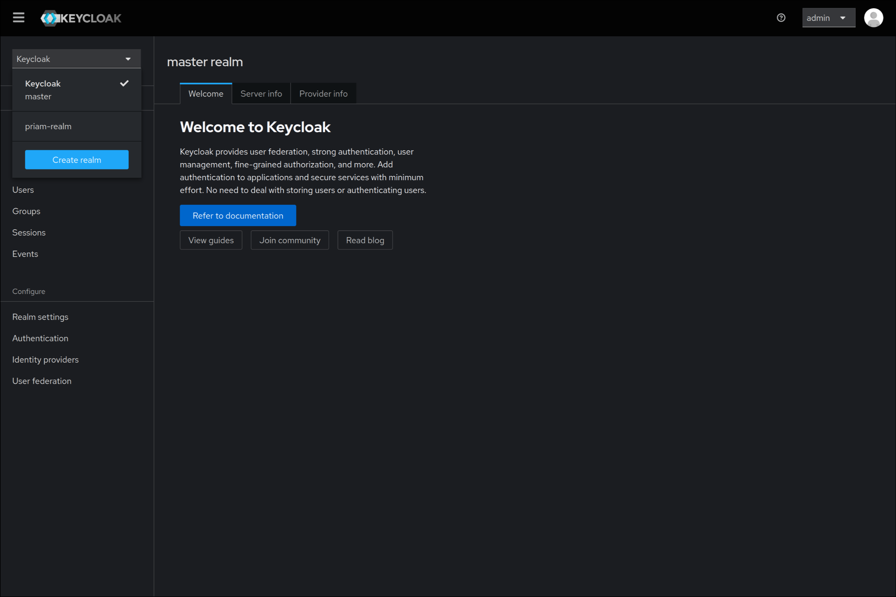

Maintenant appuyer sur "create realm" et vous allez tomber sur cette page :

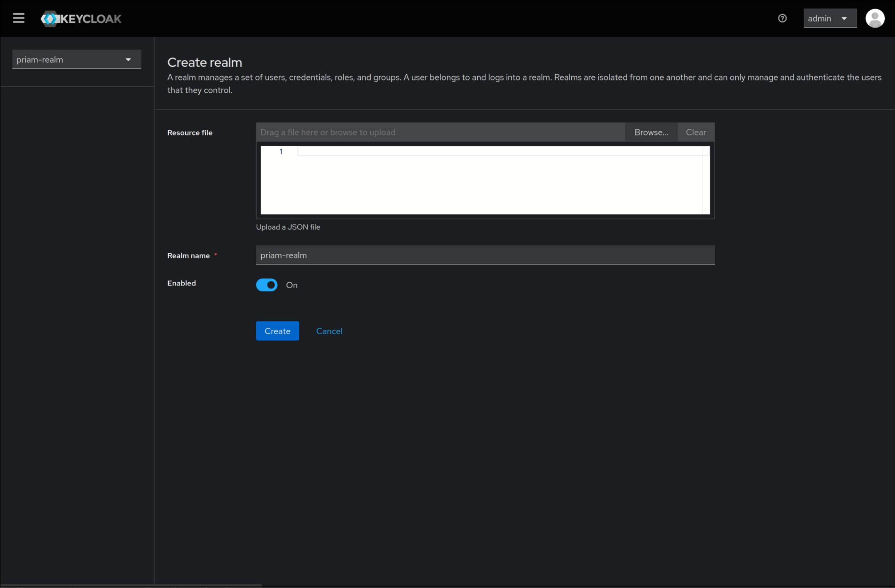

Copié exactement ce qu'il y a sur la page puis ensuite allez sur `realm settings` en bas à droite :

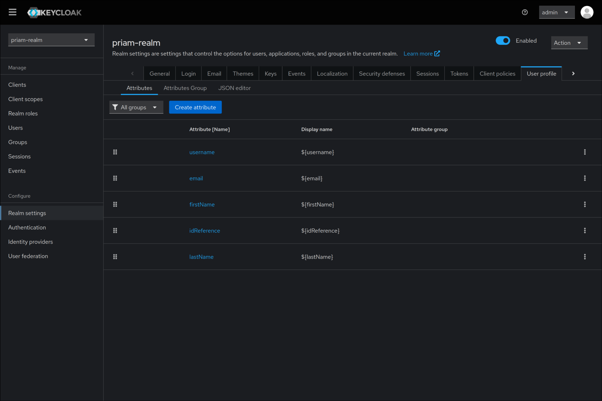

Voici à quoi doit ressembler la page. Appuyez sur `Create attribute` :

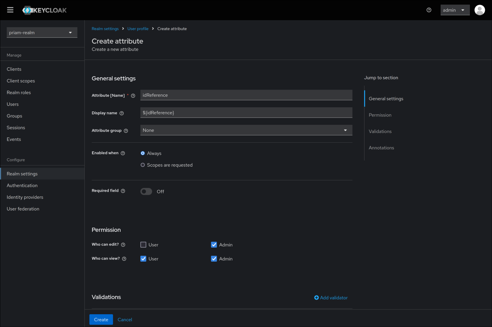

Vous tomberez sur cette page. Remplissez exactement ce qu'il y a sur la page, puis allez sur la page `Clients`. À la fin de cette partie, il ressemblera à ça :

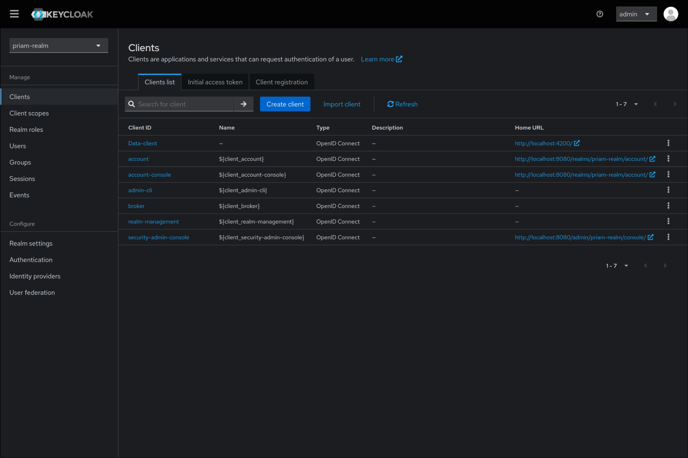

Appuyez sur `Create client` et remplissez exactement la page comme ceci :

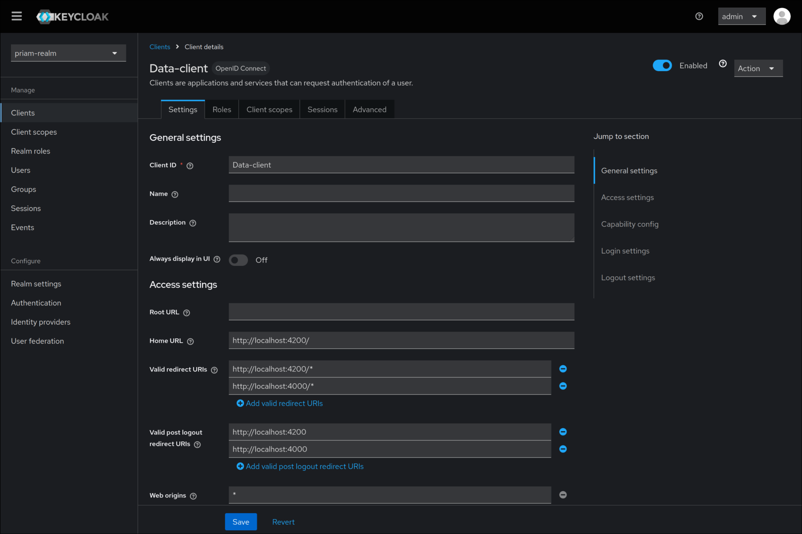

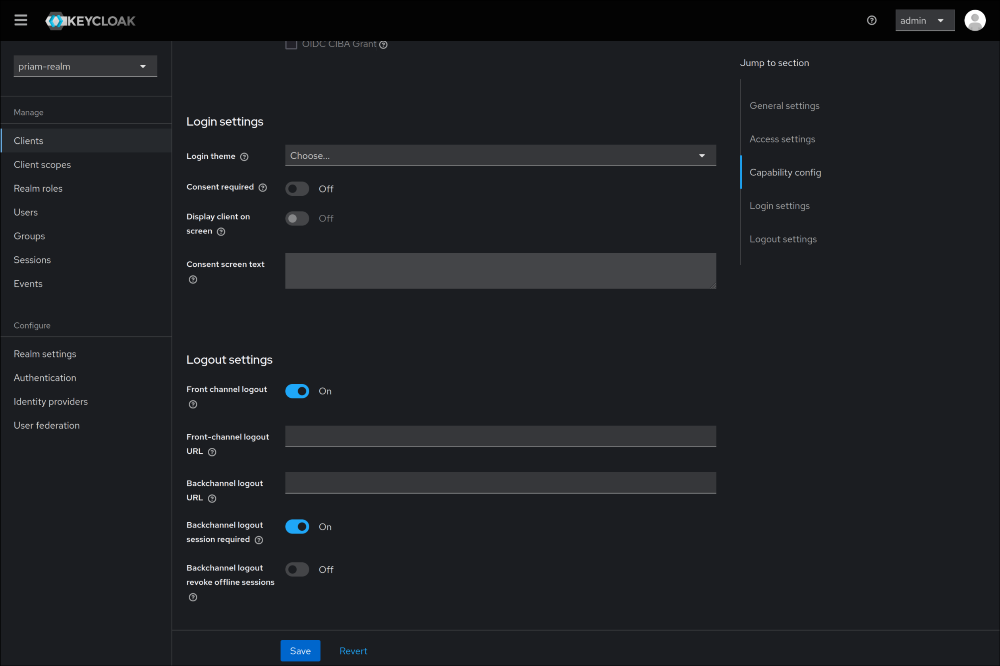

Maintenant nous allons nous occuper de la création des utilisateurs. Pour commencer allez sur la page `Users` sur la gauche. À la fin de cette partie vous aurez ces deux utilisateurs qui apparaitrons :  

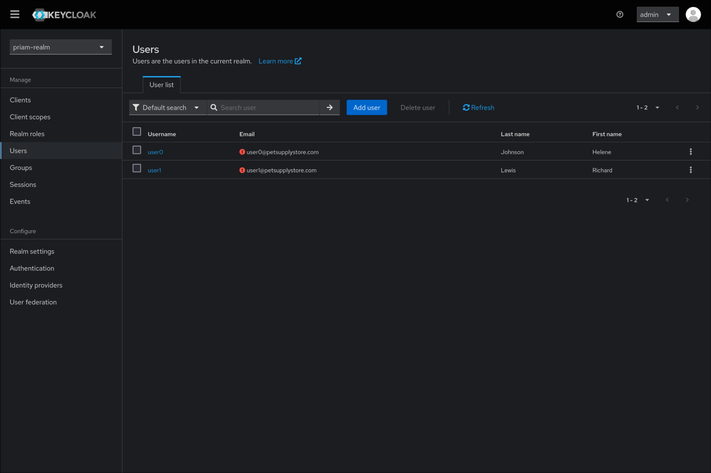

Cliquez donc sur `Add user` puis copiez à l'identique les valeurs dans la catégorie.

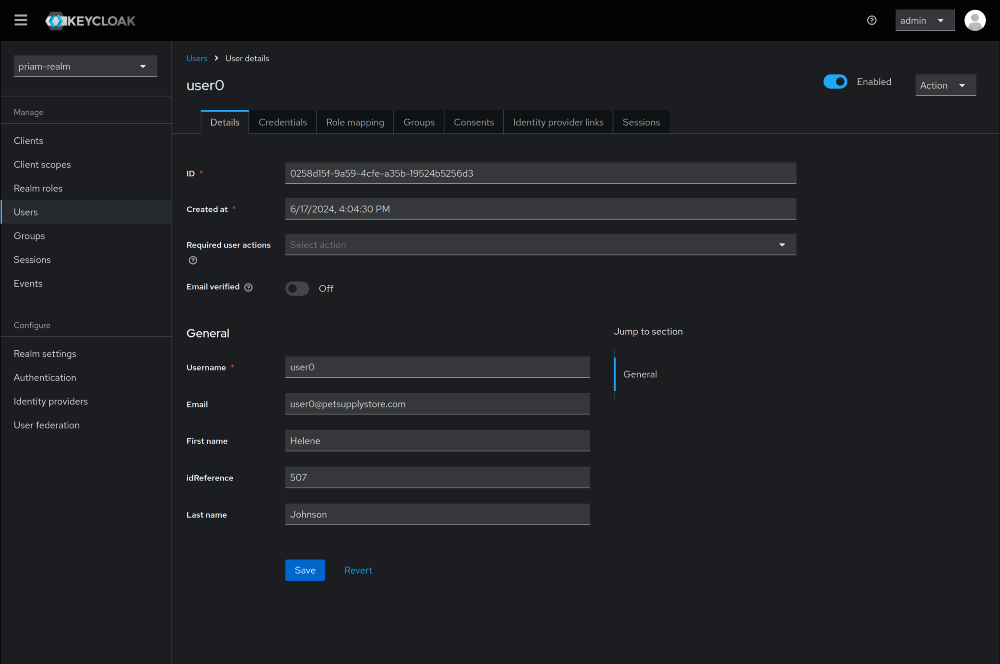

Maintenant vous devez refaire exactement la même chose avec `user1` :


À partir de là il ne manque plus qu'à faire les identifiants de connexion pour l'utilisateur 0. Revenez sur `user0` et allez sur `Credentials` : 

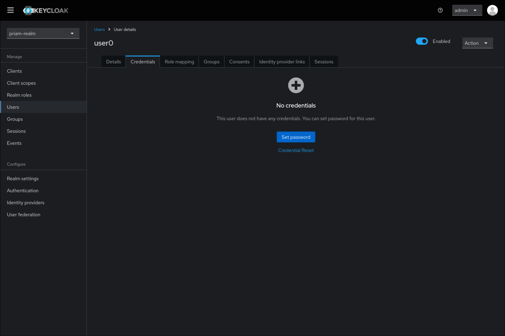

Appuyez sur `Set password` et remplissez la page comme sur les captures d'écrans : 

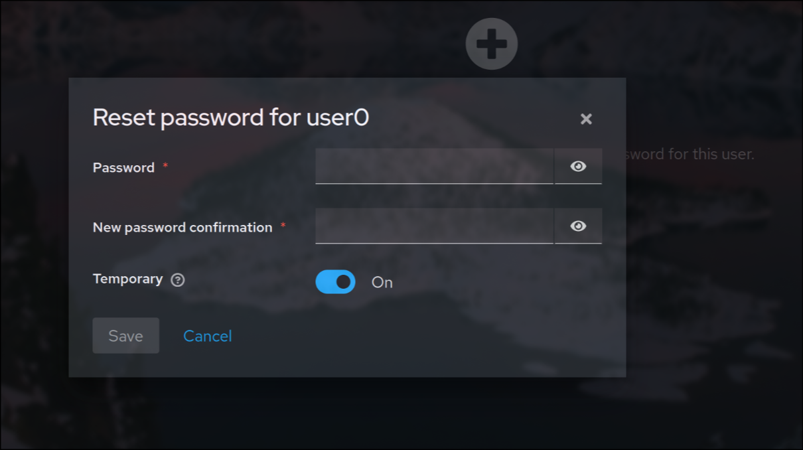
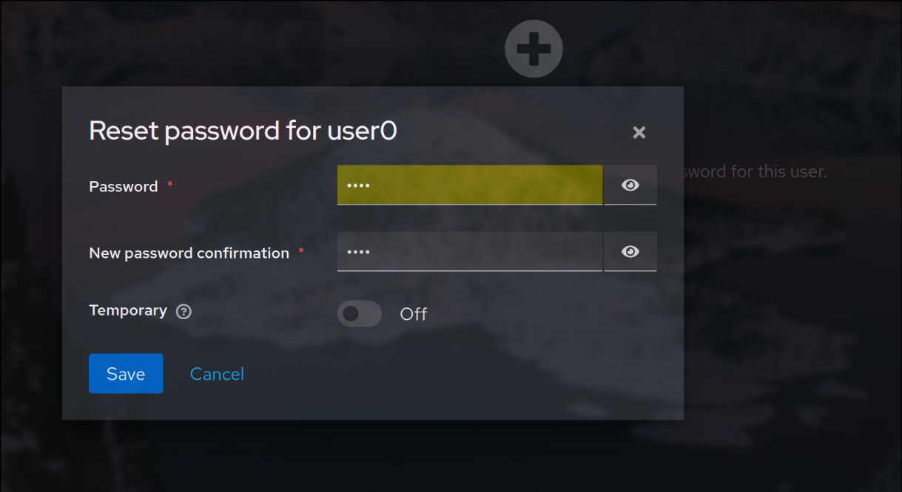

Choissisez un mot de passe que vous vous souviendrez !

## Lancement 

Il ne manque plus qu'à relancer les services ! Pour ça, utilisez la commande ci-dessous : 

```bash
docker compose up -d --force-recreate
```

Cela va relancer tous les services et les connecter entre eux pour de bon !

Maintenant PRIAM est entièrement configuré.